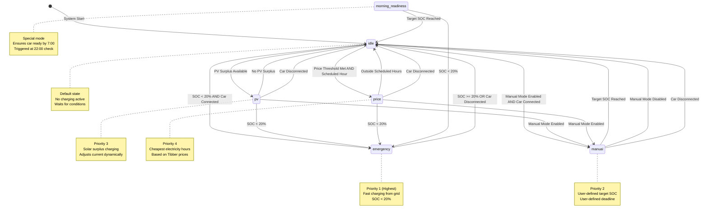
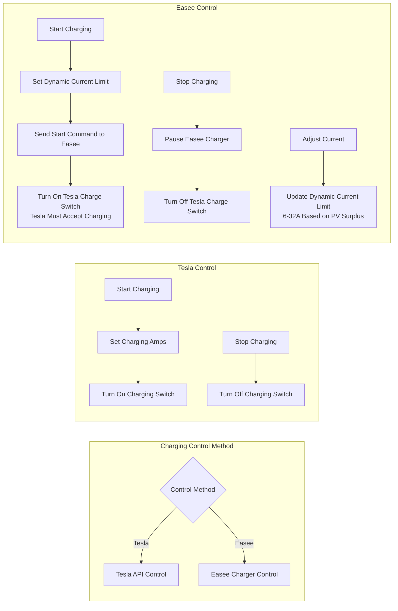
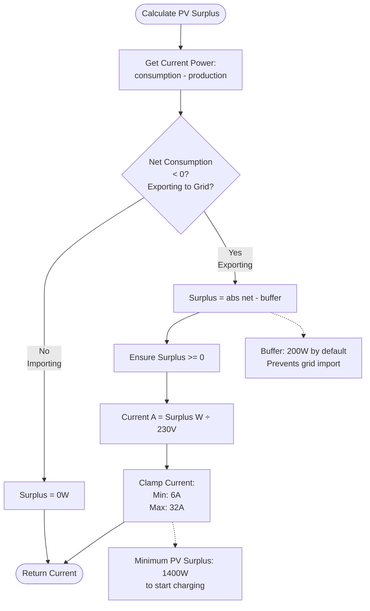

# Energy Management System - Flow Diagram

This document describes the state machine and automation flow of the Energy Management System.

## Charging State Machine

## Event-Driven Automations

```mermaid
flowchart TD
    Start([System Running])

    subgraph Triggers
        T1[Every 1 Minute]
        T2[Manual Mode Toggle]
        T3[Car Charging State Change]
        T4[Power Consumption Change]
        T5[Car Connected]
        T6[Car Disconnected]
        T7[13:00 - Price Update]
        T8[22:00 - Morning Check]
    end

    subgraph Central_Controller[Central Controller - Priority Evaluation]
        Check1{SOC < 20%<br/>AND Connected?}
        Check2{Manual Mode<br/>ON?}
        Check3{PV Surplus<br/>Available?}
        Check4{Price Charging<br/>Enabled AND<br/>Scheduled Hour?}

        Check1 -->|Yes| Emergency[Set State: emergency<br/>Start Emergency Charging]
        Check1 -->|No| Check2
        Check2 -->|Yes| Manual[Set State: manual<br/>Execute Manual Charging]
        Check2 -->|No| Check3
        Check3 -->|Yes| PV[Set State: pv<br/>Adjust PV Charging]
        Check3 -->|No| Check4
        Check4 -->|Yes| Price[Set State: price<br/>Start Price Charging]
        Check4 -->|No| Idle[Set State: idle<br/>Stop Charging if Active]
    end

    subgraph Car_Events[Car Connection Events]
        Connected[Car Connected]
        Disconnected[Car Disconnected]

        Connected --> StopAuto[Stop Automatic Charging<br/>Set State: idle<br/>Pause Easee/Turn Off Tesla]
        Disconnected --> SetIdle[Set State: idle<br/>Turn Off Manual Mode if Active]
    end

    subgraph PV_Adjustment[PV Charging Adjustment]
        PVTrigger[Every 5 Minutes<br/>OR Surplus Change]
        PVCheck{State == pv<br/>AND Connected?}
        PVTrigger --> PVCheck
        PVCheck -->|Yes| AdjustCurrent[Adjust Charging Current<br/>Based on Available Surplus]
        PVCheck -->|No| Skip[Skip]
    end

    subgraph Price_Calculation[Price-Based Charging]
        PriceUpdate[13:00 Daily<br/>OR Price Change]
        PriceUpdate --> CalcHours[Calculate Optimal<br/>Charging Hours<br/>Based on Tibber Prices]

        MorningCheck[22:00 Daily]
        MorningCheck --> CheckReady{Morning Target<br/>Reachable?}
        CheckReady -->|No| Alert[Send Notification<br/>Start Emergency Morning Charge]
        CheckReady -->|Yes| OK[No Action]
    end

    subgraph Manual_Charging[Manual Mode Management]
        ManualTrigger[Every 15 Minutes<br/>OR Settings Change]
        ManualActive{Manual Mode<br/>AND State == manual?}
        ManualTrigger --> ManualActive
        ManualActive -->|Yes| UpdatePlan[Update Charging Plan<br/>Execute Manual Charging]
        ManualActive -->|No| SkipManual[Skip]

        TargetReached{Target SOC<br/>Reached?}
        TargetReached -->|Yes| CompleteManual[Send Notification<br/>Turn Off Manual Mode<br/>Stop Charging]
    end

    subgraph Notifications[Notifications & Monitoring]
        ChargingStart[Charging Started]
        ChargingStart --> NotifyStart[Notify: Mode, SOC, Details]

        ChargingComplete[Charging Completed]
        ChargingComplete --> NotifyComplete[Notify: Final SOC, Energy Added]

        LowBattery[SOC < 20%]
        LowBattery --> NotifyEmergency[HIGH Priority Alert<br/>Emergency Charging Activated]

        IntegrationError[Integration Unavailable<br/>for 10+ Minutes]
        IntegrationError --> NotifyError[Warn: Integration Issue<br/>System May Be Impaired]
    end

    Start --> Triggers
    T1 --> Central_Controller
    T2 --> Central_Controller
    T3 --> Central_Controller
    T4 --> Central_Controller
    T5 --> Car_Events
    T6 --> Car_Events
    T7 --> Price_Calculation
    T8 --> Price_Calculation
```

## Charging Control Methods

## PV Surplus Calculation

## Configuration Parameters

| Parameter | Default | Range | Description |
|-----------|---------|-------|-------------|
| `target_soc_morning` | 80% | 20-100% | Target charge level by 7:00 AM |
| `manual_target_soc` | 80% | 20-100% | Manual mode target charge level |
| `price_threshold_50` | €0.30/kWh | €0.10-0.50 | Price limit for 50% charging |
| `price_threshold_80` | €0.28/kWh | €0.10-0.50 | Price limit for 80% charging |
| `min_pv_surplus` | 1400W | 500-3000W | Minimum surplus to start PV charging |
| `pv_charging_buffer` | 200W | 0-500W | Safety buffer to prevent grid import |
| `pv_hysteresis_time` | 1 min | 1-10 min | Manual interval control (edit code) |

## Priority Order

1. **Emergency Charging** - SOC < 20%, highest priority, always from grid
2. **Manual Mode** - User-controlled target and deadline
3. **PV Surplus** - Solar excess available for charging
4. **Price-Based** - Cheapest electricity hours from Tibber
5. **Idle** - Default state, no charging

The central controller evaluates conditions every minute and whenever key state changes occur, ensuring the highest priority condition always takes precedence.
